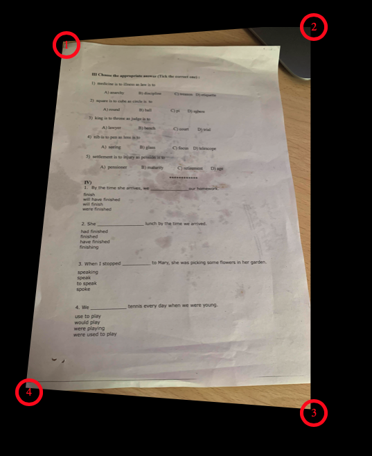

# Perspective crop
Simple javascript image crop with perspective adjust.

This project uses [Interact.JS](https://github.com/taye/interact.js) for handling the dragging corners. The code doesn't actually do the crop, but rather allows the user to set freely four corners of the image and gets the coordinates of the four adjusted points. 

The form submits the following parameters:

`**originalSize**`  array of original image size (width,height)

`**cropPoints**`  array containing x an y of the four adjusted points (top-left,top-right,bottom-right,bottom-left)

`**scaleFactors**`  array containing the scale factor of the image (width,height)

Adjustment of the perspective was intended to be made serverside (e.g. Imagemagick). Image is hardcoded in the example code, so you have to handle the upload yourself.

